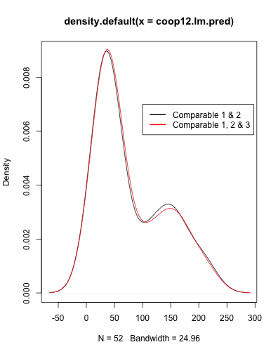
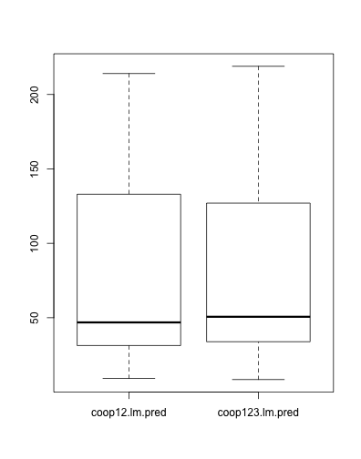
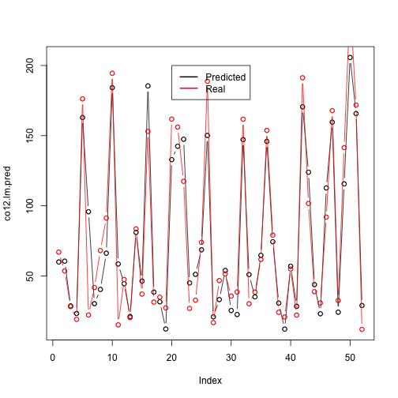
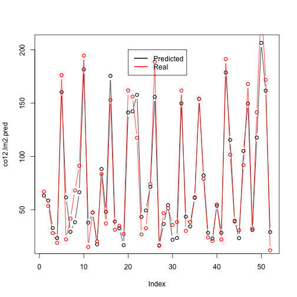

Cooperatives Properties in New York City
========================================================
Note: To compile the file, run these:

```r
source("functions.R")
library(ggplot2)
library(reshape)
```

```
## Loading required package: plyr
## 
## Attaching package: 'reshape'
## 
## The following objects are masked from 'package:plyr':
## 
##     rename, round_any
```

```r
library(knitr)
coop <- read.csv("coop_valuations.csv", header = T)
```


Summary
--------------------------------------------------------
This report contains some basic analysis of the coop_valuations.csv dataset. It investigates:
1) The market value per sqft change based on different School District. Result shows that co-ops in School District 1, 2 and 3, especially District 2, have steady value increase.
2) Comparable property 3 has been included into the dataset since Year 2012. However, there is no significant impact from this fact alone.
3) Location, income of the property and expense of the property are major factors to consider when choosing a comparable property. Then year built and gross sqft can also be taken into account
4) Expenses of the co-ops were not considered before Year 2012. It is included into the dataset in Year 2012 and there is a significant relationship between co-ops' expense and their comparable properties' expense.


Background
--------------------------------------------------------
Cooperatives (co-ops) are one type of property ownership structure in which buildings are owned by the amalgamation of "unit owners / cooperative shareholders". Assessing the value of co-op buildings for property tax purposes is therefore a slightly complicated process. The New York City Department of Finance (DOF) evaluates co-op building values by comparing them to similar rental buildings. 

The dataset contains data from between 2009 and 2012 for a subset of cooperatives in NYC. Some years' data is missing, and different buildings and different years have different numbers of comparison properties. 


Overview
--------------------------------------------------------
### 1. Price Trend of co-ops.

#### 1) Overall

I first investigate the full market price as well as market price per sqft of the co-ops. I choose the subset properties which have market value for all four years:

```r
house <- coop[, c("bbl", "tax_year", "full_market_value", "market_value_per_sqft")]
len <- aggregate(tax_year ~ bbl, house, length)
id <- len$bbl[len$tax_year >= 4]
house.full <- house[house$bbl %in% id, ]
```


I then plot their market value to have an initial idea of the market value trend:

```r
par(mfrow = c(1, 2))
ggplot(house.full, aes(x = as.numeric(tax_year), y = full_market_value, colour = bbl)) + 
    geom_line()
ggplot(house.full, aes(x = as.numeric(tax_year), y = market_value_per_sqft, 
    colour = bbl)) + geom_line()
par(mfrow = c(1, 1))
```

  


#### 2) School District

From the plot, we can see that there are increasing trend as well as decreasing trend. I am interested in seeing how location impact co-ops market value, specifically,  which School District is one property located. I divided the properties based on their borough code to have clearer plots within each subset.

```r
coop1 <- coop[coop$BoroCode == 1, ]
coop2 <- coop[coop$BoroCode == 2, ]
coop3 <- coop[coop$BoroCode == 3, ]
coop4 <- coop[coop$BoroCode == 4, ]
coop5 <- coop[coop$BoroCode == 5, ]
```


Then I plot the market value based on different School Districts within each Borough area. It turns out that School District 1, 2 and 3 on average see their properties' market value increasing throughout these years. Especially School District 2, not only does it has increasing market value, it has a relatively high market value per sqft compare to other district.


```r
par(mfrow = c(3, 2))
coop1$SchoolDist <- as.factor(coop1$SchoolDist)
coop1b <- aggregate(market_value_per_sqft ~ SchoolDist + tax_year, coop1, mean)
ggplot(coop1b, aes(x = as.numeric(tax_year), y = market_value_per_sqft, colour = SchoolDist)) + 
    geom_line()

coop2$SchoolDist <- as.factor(coop2$SchoolDist)
coop2b <- aggregate(market_value_per_sqft ~ SchoolDist + tax_year, coop2, mean)
ggplot(coop2b, aes(x = as.numeric(tax_year), y = market_value_per_sqft, colour = SchoolDist)) + 
    geom_line()

coop3$SchoolDist <- as.factor(coop3$SchoolDist)
coop3b <- aggregate(market_value_per_sqft ~ SchoolDist + tax_year, coop3, mean)
ggplot(coop3b, aes(x = as.numeric(tax_year), y = market_value_per_sqft, colour = SchoolDist)) + 
    geom_line()
# Dist 32 has increased value dramatically, however, it's only one property,
# so it lacks information

coop4$SchoolDist <- as.factor(coop4$SchoolDist)
coop4b <- aggregate(market_value_per_sqft ~ SchoolDist + tax_year, coop4, mean)
ggplot(coop4b, aes(x = as.numeric(tax_year), y = market_value_per_sqft, colour = SchoolDist)) + 
    geom_line()

coop5$SchoolDist <- as.factor(coop5$SchoolDist)
coop5b <- aggregate(market_value_per_sqft ~ SchoolDist + tax_year, coop5, mean)
ggplot(coop5b, aes(x = as.numeric(tax_year), y = market_value_per_sqft, colour = SchoolDist)) + 
    geom_line()
par(mfrow = c(1, 1))
```

     


#### 3) Borough Code = 2

One interesting thing from previous plots is that, for co-ops with BoroCode = 2, their market value per sqft decreasd from 2009-2011. However, they increased in year 2012. I then plot their first and second comparable properties market value per sqft to see whether their market value per sqft have similar trend.


```r
coop2b <- aggregate(market_value_per_sqft ~ SchoolDist + tax_year, coop2, mean)
ggplot(coop2b, aes(x = as.numeric(tax_year), y = market_value_per_sqft, colour = SchoolDist)) + 
    geom_line()
coop2cp1 <- aggregate(comparable_rental_1_market_value_per_sqft ~ SchoolDist + 
    tax_year, coop2, mean)
ggplot(coop2cp1, aes(x = as.numeric(tax_year), y = comparable_rental_1_market_value_per_sqft, 
    colour = SchoolDist)) + geom_line()
coop2cp2 <- aggregate(comparable_rental_2_market_value_per_sqft ~ SchoolDist + 
    tax_year, coop2, mean)
ggplot(coop2cp2, aes(x = as.numeric(tax_year), y = comparable_rental_2_market_value_per_sqft, 
    colour = SchoolDist)) + geom_line()
```

   


**approach:** The plots show that comparable 1 and 2 lack the trend of the co-ops. At the same time, comparable 3 is included after Year 2012. This makes me interest in whether including comparable 3 will change the market value estimation. I thus build two models using *market_value_per_sqft* from Year 2012 as response variable and *gross_income_per_sqft* and *expense_per_sqft* from Year 2012 as predictors. First model will only include comparable 1 and 2. Second model will also include comparable 3.

I thus choose subset of 2012 for analysis. 

```r
co12 <- coop[coop$tax_year == 2012, ]
# remove col that are all NA
co12 <- co12[, colSums(is.na(co12)) < nrow(co12)]
```


2/3 of the dataset will be the training set and 1/3 as test set. 


```r
CO12 <- test.set(co12, 1/3)
co12.test <- CO12$test
co12.train <- CO12$train
```


**a. Model with comparable 1 and 2**

```r
coop12.lm <- glm(market_value_per_sqft ~ comparable_rental_1_gross_income_per_sqft + 
    comparable_rental_1_expense_per_sqft + comparable_rental_2_gross_income_per_sqft + 
    comparable_rental_2_expense_per_sqft + block + BoroCode + Zip + SchoolDist, 
    data = co12.train)
coop12.lm.pred <- predict(coop12.lm, type = "response", co12.test)
```


**b. Model with comparable 1, 2 and 3**

```r
coop123.lm <- glm(market_value_per_sqft ~ comparable_rental_1_gross_income_per_sqft + 
    comparable_rental_1_expense_per_sqft + comparable_rental_2_gross_income_per_sqft + 
    comparable_rental_2_expense_per_sqft + comparable_rental_3_gross_income_per_sqft + 
    comparable_rental_3_expense_per_sqft + block + BoroCode + Zip + SchoolDist, 
    data = co12.train)
coop123.lm.pred <- predict(coop123.lm, type = "response", co12.test)
```


The following plots shows the predicted results from the two model. It shows that there is no significant difference between the two predictions, which means that including Comparable 3 does not cause the major change of co-ops' market value. We can thus make a deduction that there is no significant standard change as Department of Finance (DOF) chooses the third comparable property. 


```r
# density plot
d12 <- density(coop12.lm.pred)
d123 <- density(coop123.lm.pred)
plot(d12)
lines(d123, col = "red")
legend(100, 0.007, legend = c("Comparable 1 & 2", "Comparable 1, 2 & 3"), lwd = 2, 
    col = c("black", "red"))

# boxplot
data <- cbind(coop12.lm.pred, coop123.lm.pred)
boxplot(data)
```

  


### 2. Similarity between co-ops and their comparable properties.

#### 1) Overall

The following graphs show the correlation of one factor between co-ops and their comparable properties. A higher value means a higher correlation. From the graphs we can see that there is a high correlation between co-ops and their comparable properties for *neighborhood*, *gross income per sqft* and *estimated expense*. And a relatively high correlation for *total units*, *year built* and *gross sqft*


```r
uva.pairs(coop[, c(3, 16, 30, 45)])  #neighborhood
uva.pairs(coop[, c(9, 22, 36, 51)])  #gross_income_per_sqft
uva.pairs(coop[, c(10, 23, 37, 52)])  #est_expense
```

   


```r
uva.pairs(coop[, c(5, 18, 32, 47)])  #total units
uva.pairs(coop[, c(6, 19, 33, 48)])  #year built
uva.pairs(coop[, c(7, 20, 34, 49)])  #gross sqft
```

   


#### 2) Expense as a Predictor

I notice that estimated expense was not included in the dataset until Year 2012. I am interested in seeing whether it impacts comparable properties selection. I thus choose subset of 2012 from previous analysis. 

**approach:** Based on inital analysis, I will build two predictive models, using *market_value_per_sqft* as response variable and *gross_income_per_sqft*, *expense_per_sqft* as predictors. One model will include *expense_per_sqft*, while the other will not. I choose 2/3 of the dataset as training set and 1/3 as test set. 


```r
CO12 <- test.set(co12, 1/3)
co12.test <- CO12$test
co12.train <- CO12$train
```


**a. Model without expense as a predictor**

```r
co12.lm <- glm(market_value_per_sqft ~ comparable_rental_1_gross_income_per_sqft + 
    comparable_rental_2_gross_income_per_sqft + comparable_rental_3_gross_income_per_sqft + 
    block + BoroCode + Zip + SchoolDist, data = co12.train)

co12.lm.pred <- predict(co12.lm, type = "response", co12.test)
# Predicted vs. Actual
plot(co12.lm.pred)
lines(co12.lm.pred, type = "b")
points(co12.test$market_value_per_sqft, col = "red")
lines(co12.test$market_value_per_sqft, col = "red", type = "b")
legend(20, 200, legend = c("Predicted", "Real"), lwd = 2, col = c("black", "red"))
```

 


**b. Model with expense as a predictor**

```r
co12.lm2 <- glm(market_value_per_sqft ~ comparable_rental_1_gross_income_per_sqft + 
    comparable_rental_1_expense_per_sqft + comparable_rental_2_gross_income_per_sqft + 
    comparable_rental_2_expense_per_sqft + comparable_rental_3_gross_income_per_sqft + 
    comparable_rental_3_expense_per_sqft + block + BoroCode + Zip + SchoolDist, 
    data = co12.train)

co12.lm2.pred <- predict(co12.lm2, type = "response", co12.test)

# Predicted vs. Actual
plot(co12.lm2.pred)
lines(co12.lm2.pred, type = "b")
points(co12.test$market_value_per_sqft, col = "red")
lines(co12.test$market_value_per_sqft, col = "red", type = "b")
legend(20, 200, legend = c("Predicted", "Real"), lwd = 2, col = c("black", "red"))
```

 


I use Mean Square Error to evaluate the two models. It shows that model b (with expense as a predictor) has more accurate prediction, which means that expense has a significant impact on comparable properties selection.

```r
a = mse(co12.lm.pred, co12.test$market_value_per_sqft)
a
```

```
##       [,1]
## [1,] 419.9
```

```r
b = mse(co12.lm2.pred, co12.test$market_value_per_sqft)
b
```

```
##       [,1]
## [1,] 264.8
```


Conclusion
--------------------------------------------------------
Based on the analysis, location and gross income per sqft of the co-op have impacted the selection of comparable properties. After Year 2012, expense of the co-ops has also been taken into account as another factor to consider.


Challenges and Future Work
--------------------------------------------------------
A larger dataset will be helpful to produce more accurate analysis.

There are high correlations between predictors (ie. est expense vs. expense per sqft, gross income vs. net operating income), which makes the variable selection harder. Better understanding of the dataset or the background of the data will be helpful.
